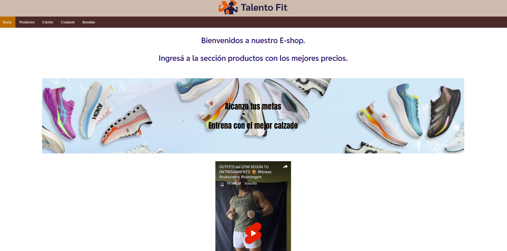

# Trabajo integrador FINAL
## Contenidos incluidos:
- ESTRUCTURA SEMANTICA: con header,nav,main, section, footer
- lista de navegacion interna: nav con ul. Con imagen, video en iFrame
- Se incluye este README.md con detalles
- Subido a GITHUB habilitado para GITHUB PAGES.
- CONTACTO: Con formulario de contacto con Formspree y campos pedidos
- CSS:
Aplicados en header, footer y lista de navegacion
Fuente Google Fonts en index
- FLEXBOX: En productos, organizados en Cards
- GRID: En Reseñas
- MEDIA QUERIES:en Contacto

## Nuevos cambios:
- Mejora de diseño general, por ejemplo el menu, contacto, reseñas. Antes habia errores de Grid.
- Control campos requeridos y patron email para Contacto.
- SEO: se agregó el meta description en las paginas
- PRODUCTOS: se agrego el JS con productos en un array de objetos y que actualiza el html mediante DOM. Se utiliza LocalStorage para agregar items al carrito
- PRODUCTOS JSON: se lee ademas un JSON de productos con FETCH
- Se agregó el CARRITO DE COMPRAS. Se visualiza el total, y se permite vaciar el carrito. Se permite además quitar un articulo, y cambiar la cantidad deseada del mismo.

